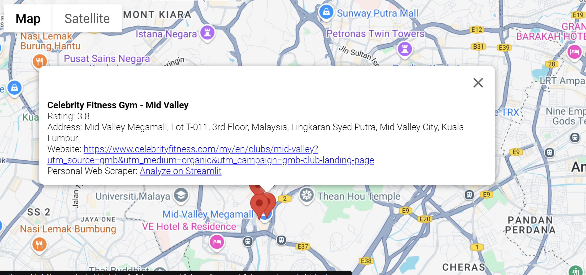
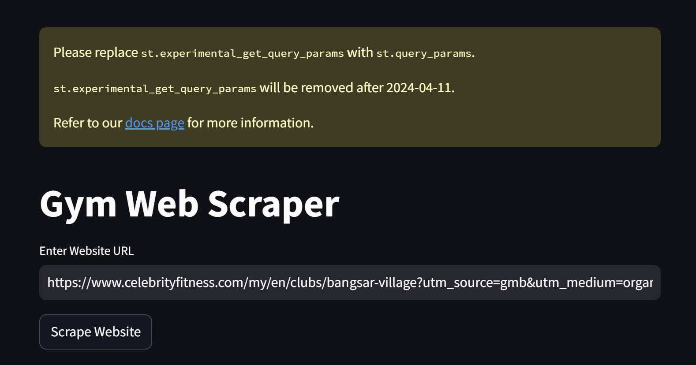
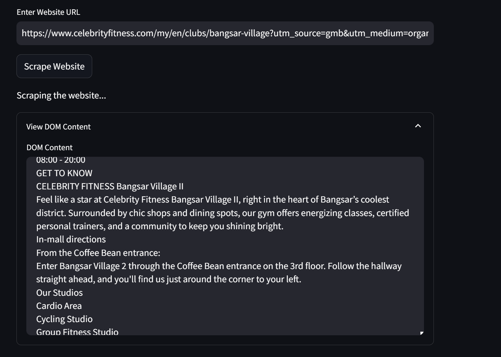
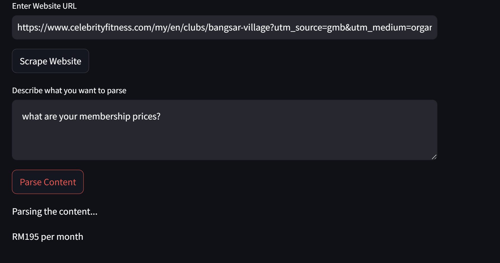
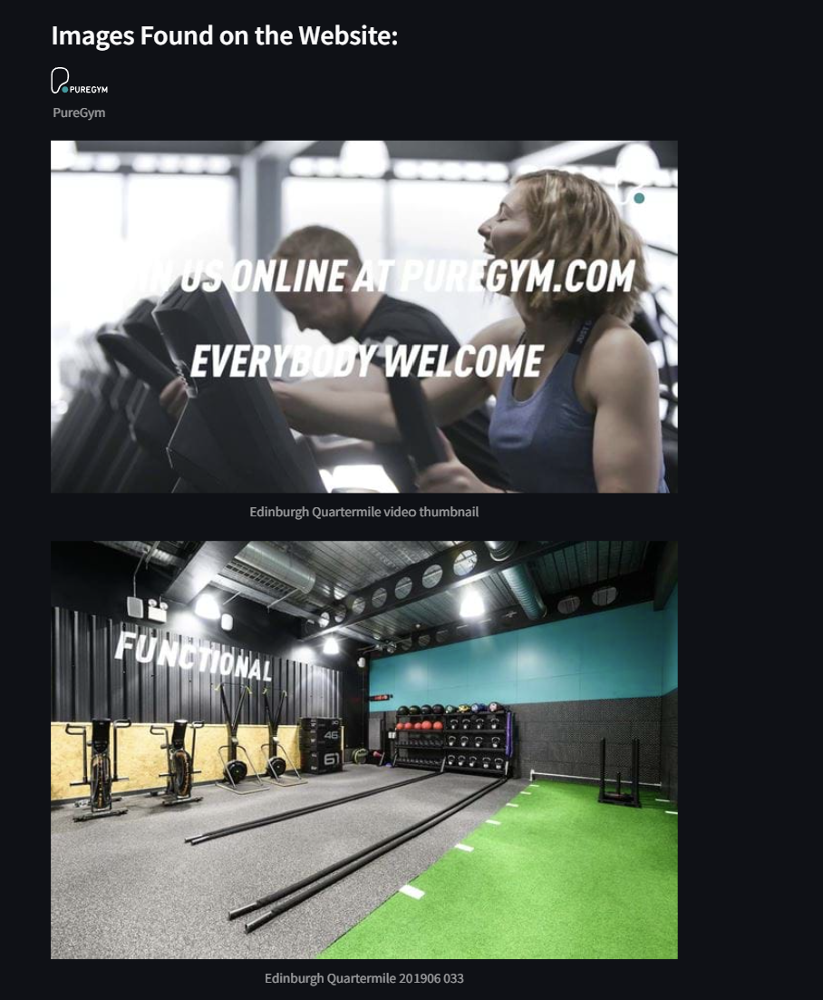

# Find-Gyms

## 💡 What is this project about

I'm from Malaysia, and something I realized here is that we don't have a good system of gyms here. We have many gyms here but getting a membership and recurring subscriptions here are pretty expensive, not to mention going trough the websites of each gym is really tidious with content split everywhere.

## 🔧 What I implemented

This project works by utlizing API from the Google Cloud Console, I'm currently utilizing Places API and Maps Javascript API

If a company registers itself as a Gym on Google, and is near a specific location, it'll be displayed as a red marker on Google Maps, as well as its other details; Name, Website, Rating. As well as my own website which is shown on the text "Analyze on Streamlit"

By pressing "Analyze on Streamlit" I've built a function which allows you to parse a website for all it's valuable content. The function utilizes Beautiful Soup and in the specific company website I am only scraping information in body while removing all tags with "script" and "style"

The textbox which asks for input utilizes langchain_ollama to classify the input sentences correctly and produces a valid response depending on the data in the gym.

## 🔨How to use the program
Please Git clone this repo and enable Live Preview on index.html and press "Analyze on Streamlit" to have Q&A with the model.
Enter your location and find gyms near you, and press on any of the gym markers to get further details as well as the "Analyze on Streamlit" to parse the data on the company website for you, and ask questions like "What are your membership prices" or "What are your opening hours" and get a valid output

## 🚧Challenges Faced
I'm not very experienced in web scraping thus, utlizing bs4 was a new thing which I needed to learn the documentation for it

My program was just supposed to extract membership prices for each gym, and trying to build a feature which just extracts any group of numbers with a currency symbol is possible by utilizing **import re** however, users wouldn't get any other feature besides the membership prices, and wouldnt understand what any of the prices meant, thus I had to think of another algo which allows me to scrape all the body content and utilizing NLP would be better for ease of use

The program is still not 100% accurate in producing a valid response, the Ollama model works well but, due to the random scraping of body content in a website, making the NLP model understand all of the data is still a work in progress

## Future implementations

- Utilize geocoding API so that users can just input an address and get gyms close to that postcode 

- Fix web scraping data so the machine learning model can understand webscraping result data better
